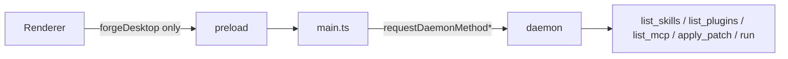

# Forge 桌面端 A+B 优化设计

**日期:** 2026-06-03  
**范围:** 稳定与安全（A）+ 功能补齐（B）  
**状态:** 已批准（用户选择 A+B）

## 目标

让 Forge 桌面端可作为日常开发入口：daemon 可靠、Electron 安全边界清晰、无本机硬编码路径；补丁可确认应用、项目可选目录、MCP/Skills 与 daemon 一致且失败可恢复。

## 非目标（本阶段不做）

- React/Vue 全量重写（方案 C）
- Skills 全文预览 / 在线编辑（可后续单独立项）
- MCP 在 UI 内增删改配置并写回 `mcp.json`（本阶段只读展示 + 指引）
- electron-builder 安装包发布流水线

## 现状摘要

| 层级 | 问题 |
|------|------|
| `main.ts` | 仅部分 IPC 使用 `requestDaemonMethod`；`ensureDaemon` 靠固定 sleep |
| `webPreferences` | `nodeIntegration: true`、`contextIsolation: false` |
| `app.js` | 硬编码 `/Users/alice/Projects/example`；MCP 页在渲染进程读盘；插件列表未统一转义 |
| 协议 | 无 `list_mcp`；`apply_patch` 已有但未接 UI |

## 方案 A：稳定与安全

### A1. Electron 安全边界

- `contextIsolation: true`、`nodeIntegration: false`、`sandbox: true`（或与 Electron 31 兼容的最小集合）
- 渲染进程**仅**通过 `window.forgeDesktop`（`preload.ts` + `contextBridge`）访问能力
- 删除 `app.js` 中 `window.require` 兜底及 MCP 页的 `node:fs` 直连
- 新增 IPC：`forge:pick-directory` → `dialog.showOpenDialog({ properties: ['openDirectory'] })`

### A2. 统一 Daemon RPC

- 抽取 `requestDaemonMethod` 为所有 daemon 调用的唯一入口（含 `run` 的事件回调变体 `requestDaemonMethodWithEvents`）
- 对 `Unknown method: *` 自动 `restartDaemon` 后重试一次（与当前 `list_skills` 行为一致）
- `list-sessions`、`status`、`cancel-run`、`apply-patch` 全部纳入

### A3. Daemon 就绪检测

- `ensureDaemon`：spawn 后循环 PING（间隔 100ms，最长 8s），成功即返回；超时抛出明确错误供 UI 展示
- 去掉 magic number `1300ms` 作为唯一依据

### A4. 去除硬编码路径

- 默认项目：`name: "默认项目"`，`cwd: app.getPath('documents')` 或 `loadConfig().defaultCwd`（若无则 documents）
- 删除 `app.js` 内 `candidateRoots` 与固定 `forge-agent` 路径
- 项目模态默认值：当前激活项目的 `cwd` 或用户主目录

## 方案 B：功能补齐

### B1. 补丁确认（`patch_proposed`）

- 右侧面板在展示 unified diff 时增加：
  - **应用补丁** → `forgeDesktop.applyPatch({ cwd, path, unifiedDiff })`
  - **关闭**（仅收起，不调用 daemon）
- 成功/失败在时间线追加 `done` / `err` 事件；`autoApply` 开启时仍展示但标注「已自动应用」

### B2. 项目目录选择

- 「新增项目」与（可选）项目设置：按钮 **选择目录** 调 `pick-directory`
- 保留手动输入 cwd 文本框

### B3. MCP 列表走 Daemon

- 协议新增 `DAEMON_METHODS.LIST_MCP = "list_mcp"`
- `handleListMcp`（`app-service.ts`）返回：
  - `configured`: 来自 `loadConfig({ cwd }).mcp.servers` 与 `loadMcpServers(dataDir)`
  - `fromPlugins`: 各 plugin manifest 的 `capabilities.mcpServers`（与当前渲染逻辑等价）
  - `hint`: 未写入 config 的插件 MCP 数量（只读提示）
- 桌面 IPC：`forge:list-mcp`；MCP 页删除 fs 扫描

### B4. Skills / 资源页体验

- Skills：客户端搜索框（按 name/id/triggers 过滤），加载失败显示 **重试** + **重启 Daemon**（调已有 status/restart 路径或文档指引）
- 插件列表：所有用户可见字符串走 `escapeHtml`
- 切换 Plugins/MCP/Skills 时显示 loading，避免空白闪烁

### B5. 运行中 UX

- `running` 时：禁用 composer 发送（保留停止）、`messageInput` 只读
- Daemon 检查按钮：失败时输出可读错误而非裸 JSON

## 数据流（目标态）

## 验收标准

1. 全新启动桌面端，Skills/插件/MCP 均可加载；升级后旧 daemon 自动恢复，无需手杀进程。
2. 渲染进程 DevTools 中 `require` 不可用（或不可访问 `fs`）。
3. 默认新项目不再包含 `/Users/alice/Projects/example`。
4. 收到 `patch_proposed` 可点击应用，工作区文件按 diff 更新（与 CLI 行为一致）。
5. 可通过系统对话框选择项目目录。
6. MCP 页在另一机器/路径下不依赖写死的 monorepo 路径。

## 风险与缓解

| 风险 | 缓解 |
|------|------|
| `contextIsolation` 破坏现有 `app.js` | 先改 preload API 齐全，再切安全开关，冒烟手动测 |
| `run` 长连接 + restart 冲突 | restart 仅在 Unknown method 时；运行中禁用 restart 按钮 |
| `list_mcp` 与 CLI 不一致 | 复用 `discoverPlugins` + `loadMcpServers`，单测 `handleListMcp` |

## 实施顺序

1. A2 + A3（daemon 可靠性，改动 main，用户立刻受益）
2. B3 + A4（MCP RPC + 去硬编码）
3. A1（安全模型，需回归全页面）
4. B1 + B2 + B4 + B5（体验）

---

**下一步:** 见 `docs/superpowers/plans/2026-06-03-desktop-ab.md`
